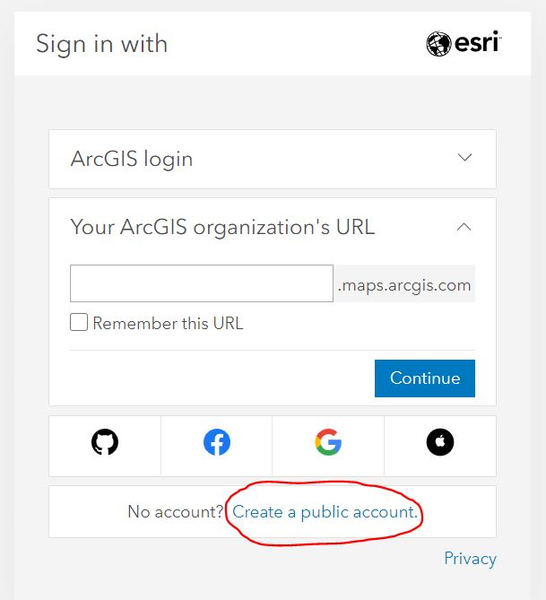
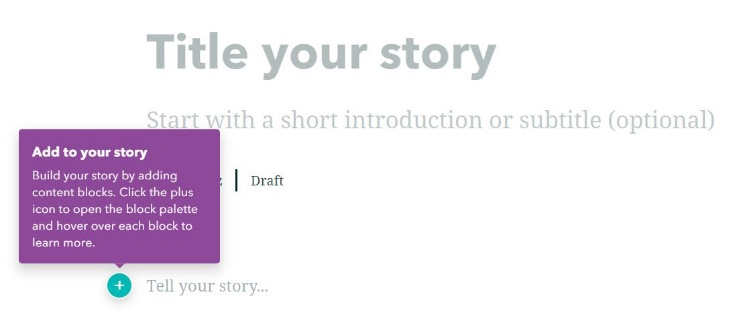
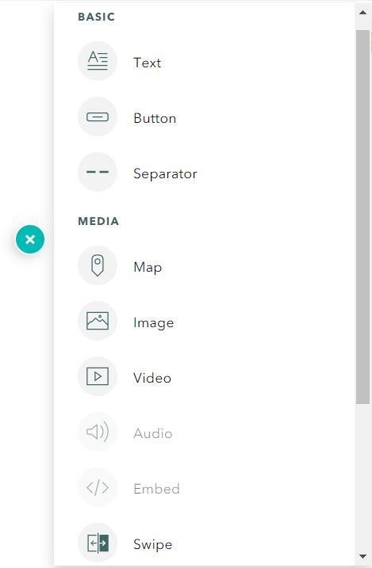
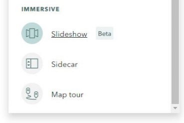
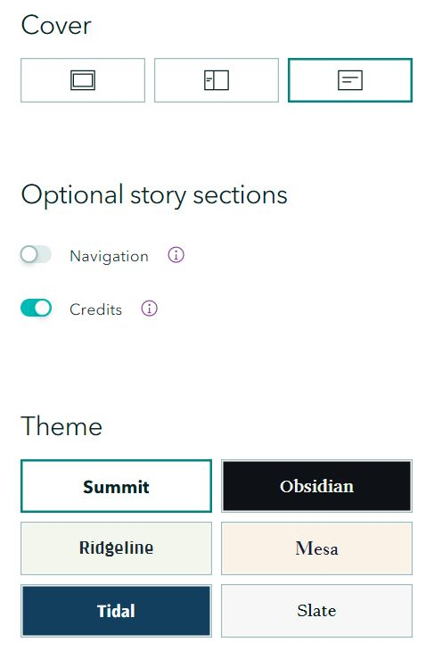

# ScrollyTelling - An Introduction to StoryMaps

"Scrollytelling" technology, some known as "StoryMaps," are platforms for building immersive narratives on the web. The story map ones have prebuilt tools that make adding richness of location information to the story a snap! Even without adding a map, this interactive way of sharing out your message is much more engaging for the reader than a plain slide deck.

For ESRI story maps, you can add content to your narrative beyond text like images, videos, maps (of course), and even sound clips if you have a fully licensed account. Knight Lab story maps, built by a journalism group at Northwestern University, is just one of the data visualization tools they've constructed. It centers on a map and easily links out to other media on the web.

There are many other scrollytelling technologies out there like webflow and shorthand, but this workshop will look into these two as they are map-centric.

Let's dive in!

## Workshop Resources
 - [ESRI StoryMaps](https://storymaps.arcgis.com/)
 - [Knight Lab StoryMaps](https://storymap.knightlab.com/)
 - [Leaflet Basemaps](https://leaflet-extras.github.io/leaflet-providers/preview/)
 - Media sources: [Unsplash](https://unsplash.com/), [Smithsonsian Open Access](https://www.si.edu/openaccess), [WikiMedia Commons](https://commons.wikimedia.org/wiki/Main_Page)

## Workshop Goals
This workshop will help you:
- Create a narrative story about your work
- Incorporate a map in your narrative
- Be aware of different platforms for interactive story telling

## Outline
- [Explore Examples](#examples)
- [Setting up a Story](#story)
- [ESRI StoryMaps](#esristorymap)
- [Knight Lab StoryMapsJS](#knightlab)
- [Sharing](#publish)

## Explore Examples

ESRI, a company that hosts many applications such as ArcGIS Online and "StoryMaps", has [storymap galleries](https://doc.arcgis.com/en/arcgis-storymaps/gallery/) that can give you a great idea of what is possible.

Here are a few ESRI story maps with different highlights:
-	[A World of Circles](https://storymaps.arcgis.com/stories/4ec682ecf79e4055ab3ad1d93adf8cf8) – satellite images presented in the “Sidecar” format
-	[Chiles en Nogada](https://storymaps.arcgis.com/collections/15788592cf844121a71a6a7dfc4cfc17?item=4) – a Map Tour and videos for a recipe
-	[Augmenting Amache](https://storymaps.arcgis.com/stories/c256b7ed97cb403aaf107742fc895f85) – embedded maps and videos of 3D reconstructions
-	[History and the City](https://storymaps.arcgis.com/stories/c54162ae75cd471286793dde45807be9) – georeferenced and 3D maps about NYC

Knight Lab example:
- [Southern Literary Trail](https://www.georgiahumanities.org/southern-literary-trail-story-map/)

##  Setting up a Story

### Collect images or videos
- Digitally gather some of your own photos, drawings, graphics, or videos you might like to insert into a story.
- Find beautiful, freely usable images by others on the [Unsplash website](https://unsplash.com/) and give credit to the photographers
-	Take a look around the [Smithsonian’s Open Access](https://www.si.edu/openaccess) images to see if any appeal to you to incorporate into your story (make sure the CC0 filter stays on as you look).
-	Explore [Wikimedia Commons](https://commons.wikimedia.org/wiki/Main_Page), another place for discovering freely usable media (use appropriate attribution!).

### Draft an Outline

Today we'll just play with the platforms for building immersive narratives, but when you tackle one for real, it's good practice to outline your story before you dig in. Think about what you're trying to accomplish with sharing your story. Here are some design hints to think about... note, images are also data in this context.

**Design**
- *data* (which sets the content of the story)
- *audience* (which sets the tone of the story)
- *message* (which sets the focus of the story)

### Pick a Platform

Given the condsiderations above about your message, audience and data, which platform best matches what you're trying to accomplish. Think not only about the structure of the product, but its distribution as well. We'll look at two possibilities in this workshop, but be aware there are others that may fit better.

##  ESRI's StoryMaps

### Create a Public ESRI account
(If you want to access all of the functions of Story Maps, such as adding audio clips, request a licensed AGOL account from your local ESRI administrator.)

An account (public or licensed) is needed to access the Story Maps application and ArcGIS Online (AGOL), an optional application for creating maps with data. 
- ArcGIS StoryMaps – a way to build narratives on the web
- ArcGIS Online – for building more custom, data-based webmaps to enhance your stories

#### The storymap URL
- Go to https://storymaps.arcgis.com/ and click “Sign in”:
-	Next, look for the Create a Public Account link at the bottom of the next pop-up window:

 
-	You won’t log into an “organization” in the future, you’ll expand the “ArcGIS login” above and enter your username and password.
-	This account will allow you to make great stories, it just doesn’t have all of the functions of the licensed accounts. It has many built-in widgets for constructing your graphic narrative including “Express Maps.”
-	Click on “+ Create new story” (or “+New story” if you’ve already made one to start another) and play with the graphical interface for adding content and think about how the options relate to the examples you liked in the storymap galleries! More information on the graphical guide is just below.

#### The ArcGIS Online (AGOL) URL
If you want to explore AGOL you can use the SAME account credentials to log in to https://www.arcgis.com/. This is an application for building data-based webmaps.
- Different application, different URL, same company, same account
- Use this to add custom maps to StoryMaps you build with your own spatial data files

### Build your story!

Use an outline for your story so you have a vision of how it fits together. This will help in choosing the elements that will highlight your narrative. Think about how you want to use images, videos and maps.

Start with an eye-catching image or video to accompany a short, interesting title. Grab the viewer’s attention!

Once you’ve created an account and have logged in at storymaps.arcgis.com, you’ll find a graphical interface that will help you add elements to your story. These elements naturally stack as you scroll down, but you can go back and insert/delete/move what you’ve added.

Below are some quick basics, but for a more detailed overview of this process, see [Allen Caroll’s guide](https://storymaps.arcgis.com/stories/cea22a609a1d4cccb8d54c650b595bc4) (He and his team are the creators of ESRI’s Story Maps).

- Click on the “+New story” button. You’ll see a start page like this: 

- Title your story by clicking on the text and typing… it’s that simple!
- Add a dramatic image or video to go along with your title by looking in the upper right for a button that says, "Add cover image or video."
- Use the “+” button seen next to “Tell your story…” to add different types of content:

, 

- The Basic menu provides different text options such a heading or paragraphs, buttons for links and visual separators.
- The Media menu is where you can add maps via the Express Maps tool or maps from your AGOL account.
- The Immersive menu allows for more elaborate story structures. They all have sub-menus for adding content. For example, Basic and Media menus are available within Sidecar.

- Story Maps have different design options including how your title area looks and the overall theme (colors and fonts). You access these by clicking the “Design” button in the upper right next to Preview and Publish to see the following options:

- When you are happy with your story and want it live on the web, click the “Publish” button and *voilà* you’ll have a URL you can use to share your work!

##  Knight Lab's StoryMap

This platform builds something similar to ESRI's 'Map Tour' with a main header map with each slide in the story representing one location on the map.

Sign in to the Knight Lab StoryMapJS via a Google account.

Pick a basemap for the project from the dropdown or look for further options on the [Leaflet Providers Page](https://leaflet-extras.github.io/leaflet-providers/preview/)

Customize your background and markers. You can find freely usable map pins on the [Clker site](http://www.clker.com/search/map+pin/1) among other places.

Add a slide and build out each point of interest per slide!
- Enter location with lat/lon in decimal degrees or find locations using built-in geocoder provided by Mapbox
- Add media. You can enter links or upload images. The size of your uploaded image should be appropriate for the webpage (it doesn't get rescaled)
- Add a Headline for each slide.
- Add text, including links.

##  Publish and Share!

In the end, the purpose of these and other scrollytelling platforms (there are many!), is to share your work on the web with your audience. Each platform most likely will have options underneath a "Publish" or "Share" button.

ESRI - use the Publish button to make your URL active
- Public account has a choice between keeping your story private or fully public
- Licensed account allows for sharing as per the admin rules by the licensing organization

Knight Lab - use the Share button
- Copy the provided link to share on social media
- Use the embed code to incorporated the storymap into a webpage

Think about how your content will be maintained. Considerations include lifespan of both accounts, external links and technology.

**Have Fun!!!**

